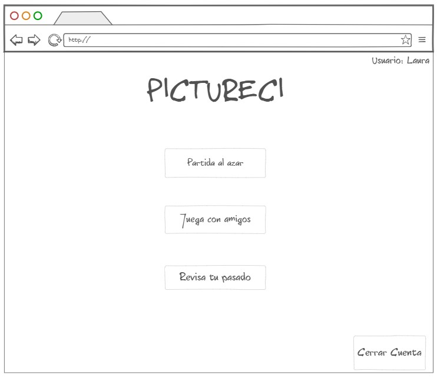
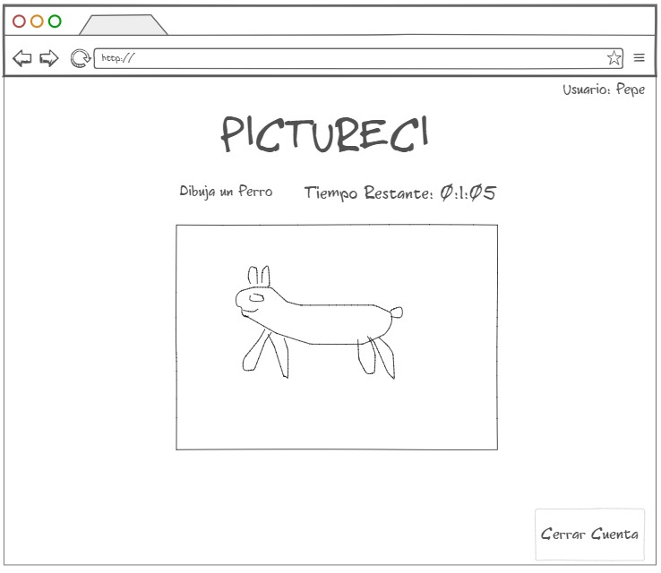

# ARSW--2017-2-PICTURECI

## COMPUTATIONAL ENGINNERING 

## ESCUELA COLOMBIANA DE INGENIERIA JULIO GARAVITO 

## Software Architecture 2017-02
## Teacher: Hector Fabio Cadavid 

PicturEci is based on the game "Pictionary" and other similar online,
The game will have the classic modes of competing with a limited time, and words by category, etc ...
The added value of the project lies in a new gameplay that will test the ability to concentrate and
Multitasking of the players, since in addition to a player draws the object that was requested,
ISimultaneously another third player tries to guess the drawing.
and as if this were not enough, you will have extreme ways to give your game more fun, 
with limited time, complicated objects, and many other things.

## Before starting the game

## View of the players who draw:

## View of the player trying to guess:

A possible future advance in the architecture is considered to guarantee availability, and scalability. A posbile architecture of the same would be this:  

  
## Link Google Drive: https://drive.google.com/drive/folders/0B_4JeHYUqRALdlFEZU01QUZ2WU0?usp=sharing (Only for teacher and autor )

## Limk Trello: https://trello.com/b/9cLVOejy/arsw-2017-2-pictureci-historias

## Link CircleCI : https://circleci.com/gh/ArswPICTURECI/ARSW--2017-2-PICTURECI

## Link Heroku app: https://pictureciarsw.herokuapp.com/

  
### Autor:
##### Daniel Felipe Rodriguez Trujillo
##### Camilo Andres Torres Torres
##### Leonardo Castro
